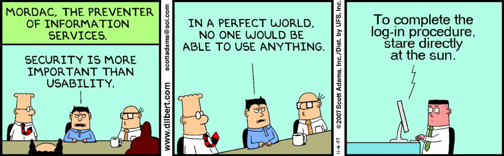
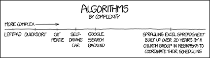
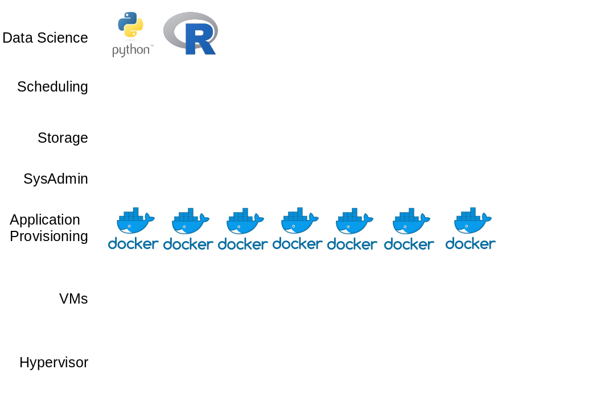
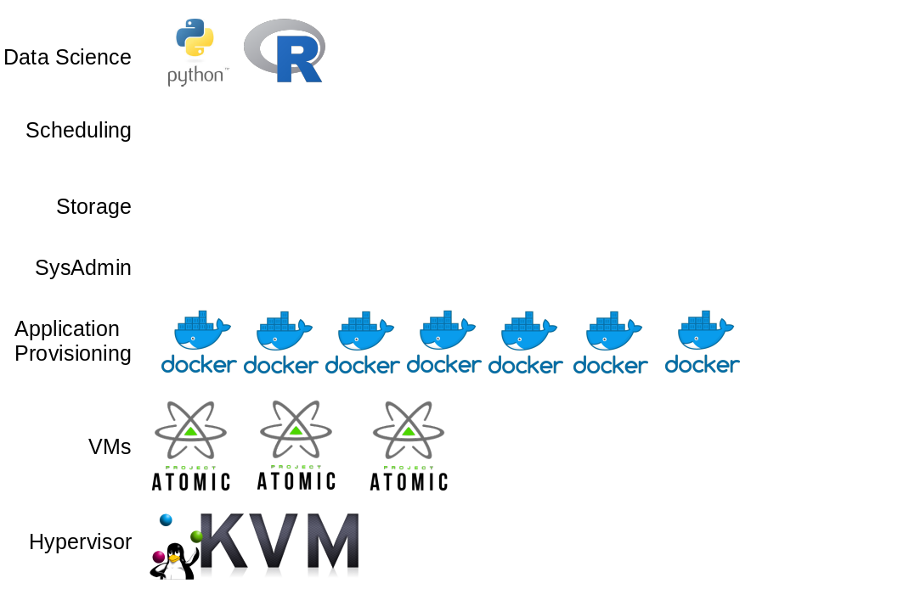
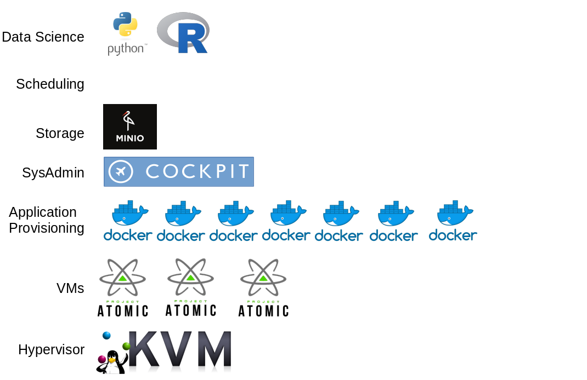
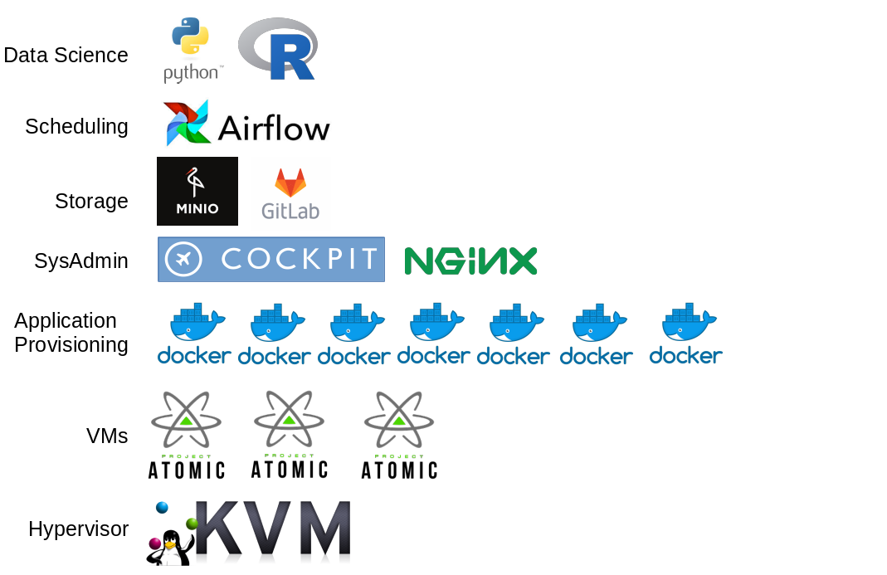
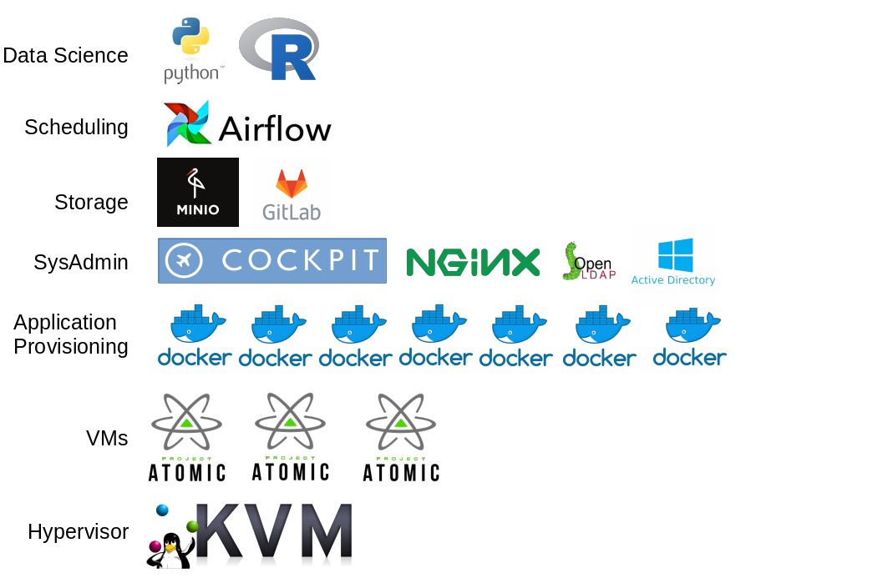

```{r setup, include=FALSE}
options(htmltools.dir.version = FALSE)
```

class: inverse, middle, center


???


---

# Why do companies hire data scientists?

- Numerical sophistication: Increase efficiencies with (regular) statistics

--

- Automation: Increase productivity by automating parts of workers jobs

--

- Exploration: Learn something aboutt their business they didn't know

--

- Experimentation: "We don't want to get left behind"

--

- Unify large silos: Get underneath the BI layer, connect different large systems 

--

- To push the technical edge: IoT | agile | cloud | NoSQL | Blockchain | Hive-mind | Singularity  

---

# Necessary priors

- Numerical sophistication: Do we have software that does this math?


- Automation: Do we have triggering systems on place?


- Exploration: Can we connect to our underlying databases? 


- Experimentation: Has the business performed an 80/20 exercise? 


- Unify large silos: Is there DB admin skill to open these dbs up? 


- To push the technical edge: How to owners of exisiting technological stack feel about this?

--


---
# Getting work done

Traditional Corporate IT concerns - 

- Multiple versions of the truth
- Technical debt
- Security
- Stability
- Providing uniform tools to workers across the organisation

These are important considerations!



---
# Getting work done

Typical Constraints -

- Machines have to use enterprise software [MS Office / Sharepoint / SAP]
- No admin access to laptops
- If it is on the corporate network, IT totally controls the stack
- Server internet access is strictly controlled

--

Solution 1:

Flash drives, and your macbook from home

1. Insecure
2. Compute limited
3. Maybe against the rules
4. How will you possibly productionize?

---
# Getting work done

Typical Constraints -

- Machines have to use enterprise software [MS Office / Sharepoint / SAP]
- No admin access to laptops
- If it is on the corporate network, IT totally controls the stack
- Server internet access is strictly controlled

--

Solution 2:

Wait for the organisation to catch up

1. Work on Excel
2. Manually download data using enterprise application UI
3. Work with IT to refactor models into enterprise-compatible code



---
# We can do better

How do we do *good* data science, that *has impact*, in a *low-cost*, *low-risk* way?

--

**Build a system that does everything you need it to**

--

- Don't distract other departments from their work

--

- Don't hire anyone else

--

- Don't compromise existing systems

--

- Don't use the cloud, don't spend any money or pay for any licenses!

--

**Achievable?**

--


---

# Ideal system specifications

- *Good interoperability:* can our systems talk to each other? Can they talk to anybody?

--

- *Large, unstructured storage with fine-grained control:* can we dump data somewhere? can we secure access? can we make it available to anybody on the network?

--

- *Code repositories:* can new work be versioned? Multiple collaborators? Branching for experimentation?

--

- *Code review:* do we have regular over-the-shoulder converstaions about what our developers are doing?

--

- *General purpose job scheduling:* do we know how to fire scripts

--

- *Disposable, scalable environments:* how long does it take to give someone an isolated environment with 2 cores and 2GB ram? What about 16 cores? What about 64?


---
# Roadmap: Get started on a laptop


---

# Roadmap: Get an isolated server



---
# Roadmap: Add storage capacity


---
# Roadmap: Add good code practices


---
# Roadmap: Start building pipelines


---
# Roadmap: Unify auth


---
# Roadmap: Integrate


---
# Some of our containers

`cityofcapetown/datascience`   
tags: `base, python, python_gpu, R, jupyter, jupyter_gpu, R, R_nonstandard, rstudio_shiny`

`cityofcapetown/nginx_proxy`  
`cityofcapetown/docker_wui`  
`cityofcapetown/docker_mkdocs_deploy`  
`cityofcapetown/airflow`  

---
# Back to IT Concerns


- *Multiple versions of the truth* -> Pipelines + code version control = auditability
- *Technical debt* -> Provide access to model predictions via API; swap code underneath if needed. All tools are fully cloud compatible and easy to migrate.
- *Security* -> Isolated from corporate network. Isolated into VMs. Isolated into containers. Code transparently housed in git.
- *Stability* -> Isolation and limiting of processes via container.
- *Providing uniform tools to workers across the organisation* - All UI access via browser (not IE though, Jupyter!)

---

# Costs

## Money
- *Hardware:* R0 for decommissioned server or cluster of decommissioned consumer towers; Up to ~R1m for a fully loaded server.

--

- *Software:* R0

--

- *New hires:* R0

--

## Time

--

- *Admin load:* A day a week

--

## Obligations

--

- This is Open Source! Contribute upstream. 

---
# Enterprise support

## If you *reallly* want to spend money

- KVM -> Get enterprise Linux (Red Hat / SUSE / Ubuntu etc)
- Docker CE ->  Docker EE
- Gitlab EE -> Activate License
- Minio -> Minio SUBNET
- RStudio Server -> RStudio Server Pro
- NGINX -> NGINX Plus

...and all the consultants you can afford

---
class: inverse, middle, center

# Now we can get to work!


