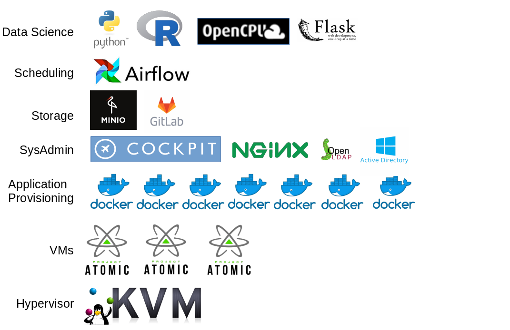
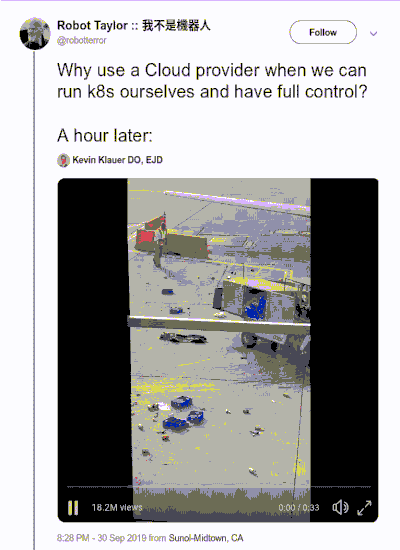
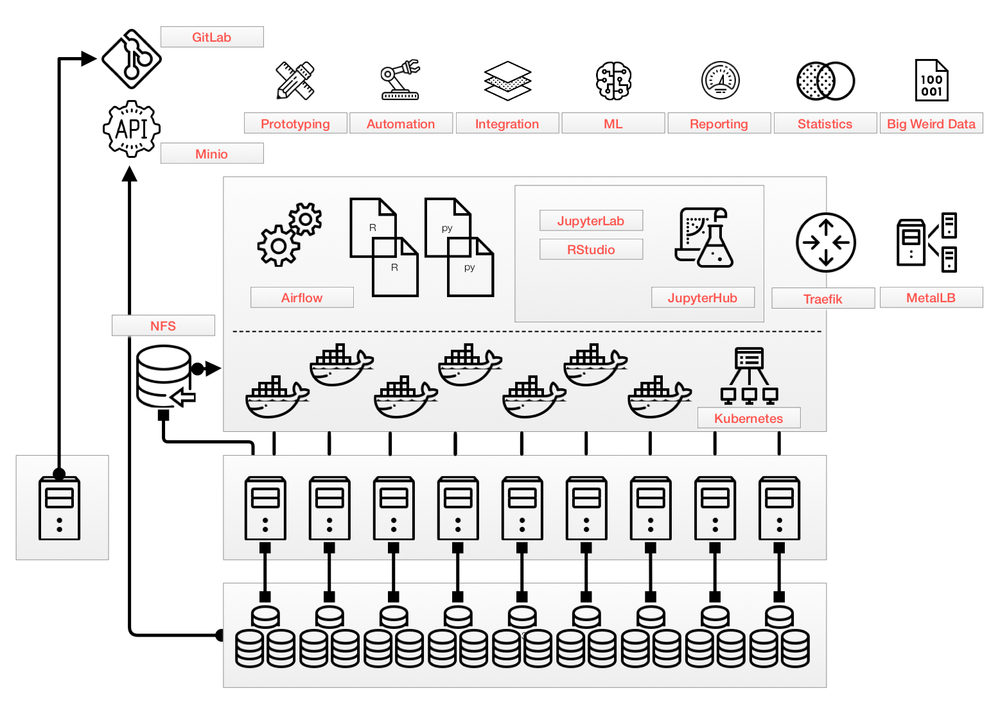
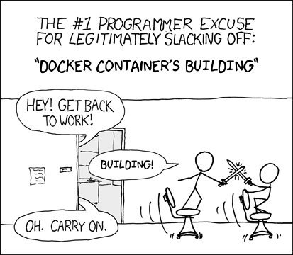

```{r setup, include=FALSE}
options(htmltools.dir.version = FALSE)
```

???


---

# What we will cover in 40 minutes

## Topics:

* Where I am from
* Why I did this
* What I did
* How I did this
* Benefits and costs
* Demo of this

## If you want to go digging:

* GitHub repo: https://github.com/riazarbi/k8s_setup
* SSID: KUBE_DEMO  
* Node IPs: master - 192.168.8.90 workers - 192.168.8.91 & 92   
* sudo user: centos-master  & password: kubernetes   
* cockpit admin url: https://192.168.8.90:8999  
* traefik web proxy dashboard: https://192.168.8.80/traefik/dashboard  
* jupyterhub sandbox: https://192.168.8.80/sandbox 

---

# Where I am from

**Who I am**

I am a data scientist from a ULO*.

Day-to-day tools include R, python, airflow, bash, docker.

I'm not a programmer or sysadmin.

I mostly build systems in order to get my work done.

**My environment:** 

- ULO has a full Microsoft stack, but data science works better with Linux.
- ULO procurement is a nightmare.
- BUT we managed to get some Xeon servers in a local rack.
- Rule of thumb is smallest amount of complexity to get the job done.

.footnote[*Unspecified Large Organisation]

---

# Our original stack

.center[]

---

# Why I did this

.center[]

---

# Why I did this

**I didn't want to do this.**

Atomic Host + Docker + sneaky nginx rewrites works well, **but we were getting too big**

- ULO CAN'T USE CLOUD.
- Noisy neighbor effects on docker daemon.
- Airflow jobs klap resources.
- We wanted 'brutal death' AND 'spontaneous regeneration' for workloads that spin out of control.
- Single points of failure.
- Multi user auth was getting too complex.

---

# What I did

.center[]

---
# How I did this

`git clone https://github.com/riazarbi/k8s_setup && cd k8s_setup`  
`nano set_variables.sh`  
`bash kubernetes-deploy.sh`

.pull-left[## Ingredients

- CentOS
- `kubeadm`
- `helm`
- `metallb`
- `traefik`
- `jupyterhub`
- `rstudio`
- `nginx`
- `velero`
- `minio`
- wrap it in `bash` !!!
]

.pull-right[## Gotchas

- k8s expects a load balancer -> use MetalLB
- k8s expects block storage service -> use NFS Client Provisioner 
- corporate proxy pain -> yum, docker, helm
- no control over subdomains -> use traefik pathprefix rewites
]

---

# Benefits and Costs

## Benefits

- Completely free and open source   `☁ ▅▒░☼‿☼░▒▅ ☁`
- Two-person team can realistically serve content and tools to hundreds of people.
- Edit one config file and deploy. ~10 node cluster up in 3 hours.
- Everything is in yaml (although I hate yaml)
- Scaling is easy - add a node
- Object storage is distributed.

--

## Costs 

- Probably can't get everything out of my head and into a repo
- Much more admin vs old config. ~1% sysadmin -> ~10% sysadmin
- Hard to track down points of failure - e.g. traefik breakdown early September
- Kubernetes moves fast - e.g v1.16 API deprecations & JHub

---

# Rules to live by

- Save 6 cores / 24GB RAM for dev cluster
- Break it down and deploy it continuously and fix breaks as they emerge
- Lock as many image tags as possible
- Read the kubernetes release notes

.pull-left[]
.pull-right[]
---

# Demo of this

.center[]

---

